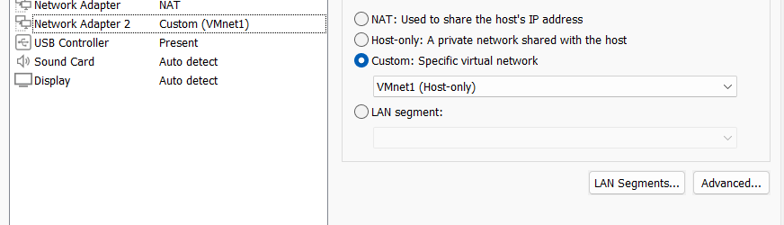
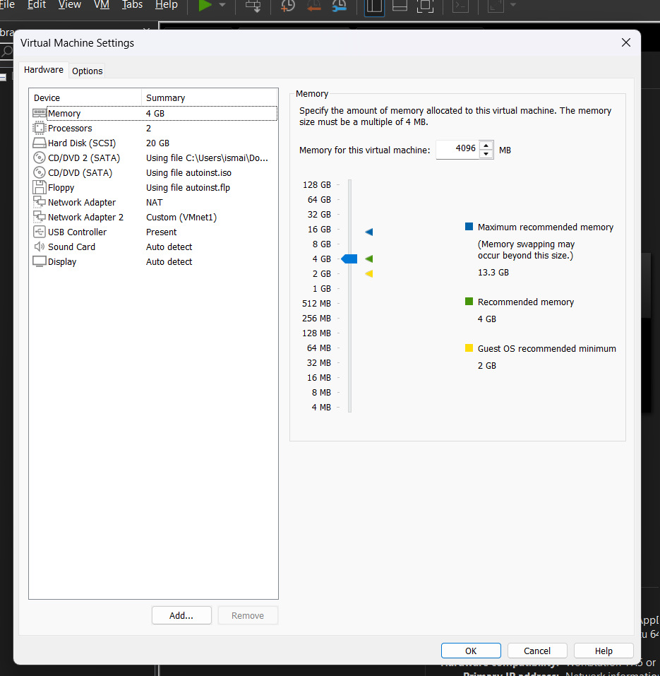
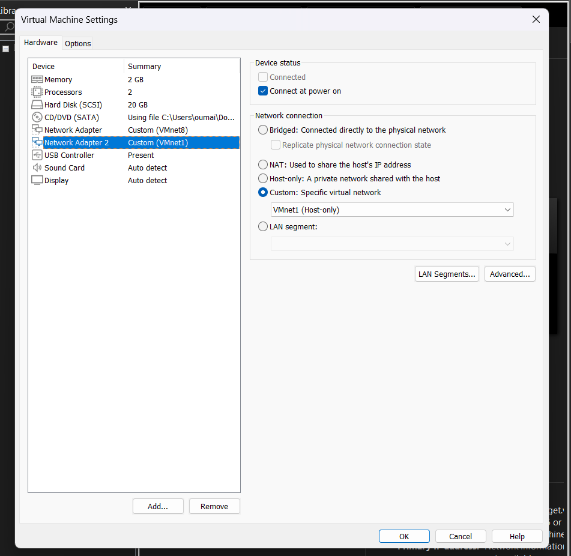
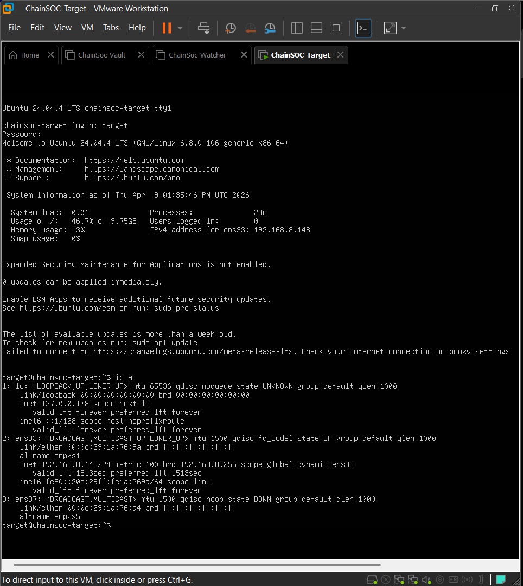
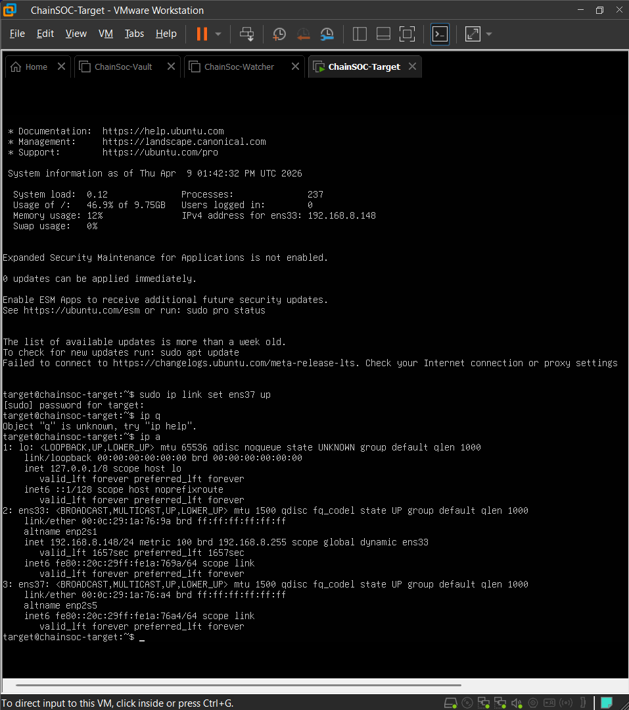
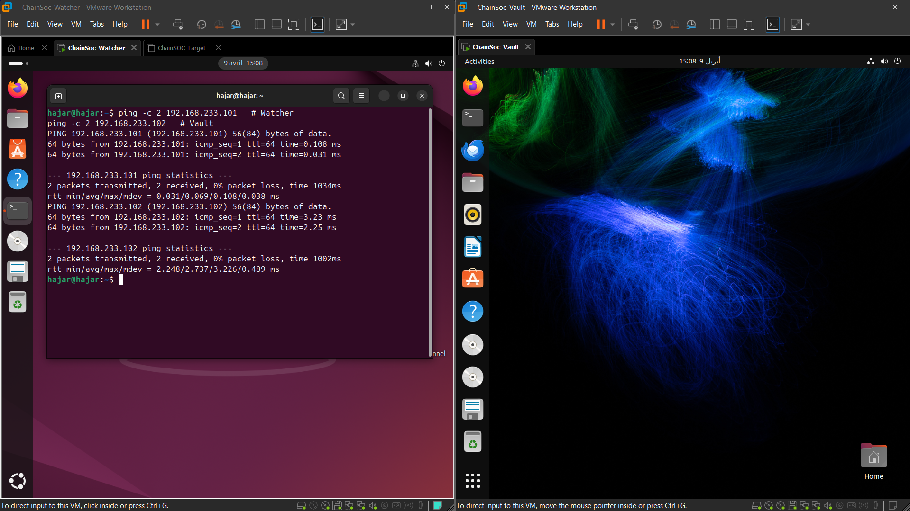

# Préparation du réseau inter-machines – ChainSOC

## Contexte
Ce document présente l'état d'avancement de la préparation du réseau pour les trois machines virtuelles du projet ChainSOC. L'objectif de cette étape est de configurer les machines de manière à permettre leur communication sur un réseau privé stable de manière indépendante, tout en conservant un accès au réseau externe.

## Architecture réseau retenue
La topologie de chaque machine repose sur deux interfaces distinctes configurées via VMware :
- **Adaptateur 1** : configuré en NAT pour fournir un accès Internet au système (mises à jour, requêtes sortantes).
- **Adaptateur 2** : configuré en Custom Host-only (VMnet1) pour assurer la communication privée et isolée entre les machines virtuelles du projet.

## Préparation des machines

### Watcher
La machine Watcher est configurée et validée au niveau de l'hyperviseur.

### Configuration réseau VMware de la machine Watcher

La configuration VMware de la machine Watcher valide la présence des deux adaptateurs réseau (NAT et Custom VMnet1), conformément à l'architecture retenue.

### Vault
La machine Vault bénéficie d'une configuration similaire et validée.

### Configuration réseau VMware de la machine Vault

La machine Vault dispose des adaptateurs réseau adéquats pour communiquer sur le réseau privé VMnet1.

### Target
La machine Target a été partiellement préparée. Au niveau de VMware, son rattachement au réseau virtuel privé a bien été effectué.

### Configuration réseau VMware de la machine Target

Cette capture confirme l'affectation de l'adaptateur de Target au réseau Custom VMnet1.

Toutefois, la configuration interne du réseau sur la machine Target est toujours en cours d'élaboration. 

### État initial du réseau Target

À ce stade, l'interface `ens37` dédiée au Host-only est reconnue par le système mais se trouve à l'état inactif (DOWN).

### Activation de l'interface Target

L'interface a été passée à l'état actif manuellement. Aucune adresse IP IPv4 valide n'a encore été rattachée, confirmant que la configuration de Target n'est pas encore finalisée.

## Adressage retenu
Les adresses IP statiques suivantes ont été prouvées par les tests opérationnels :
- **Watcher** : `192.168.233.101`
- **Vault** : `192.168.233.102`
- **Target** : *En attente d'attribution d'adresse statique.*

## Test de connectivité
Le fonctionnement du réseau privé mis en place entre Watcher et Vault a été testé de manière concluante.

### Test de ping Watcher vers Vault

Cette capture justifie :
1. L'adressage local IP de la machine Watcher à travers le test `ping` ciblant sa propre adresse locale (`192.168.233.101`).
2. La communication fonctionnelle et fluide vers la machine Vault (`192.168.233.102`), avec un taux de perte de paquets nul (0%).

## Résultat obtenu
- Le maillage réseau entre les machines **Watcher** et **Vault** est configuré, valide et totalement opérationnel. 
- La connectivité VMware de la machine **Target** est en place, mais la déclaration IP interne de son interface relève des prochaines étapes de déploiement et reste à terminer.

## Conclusion
L'architecture réseau de base (Host-only / VMnet1) est déployée avec succès. Les piliers de supervision et de stockage (Watcher et Vault) ont validé leur test de connectivité. Il restera à attribuer la configuration réseau système finale à la machine Target pour clôturer la liaison entre les trois composants de ChainSOC.
